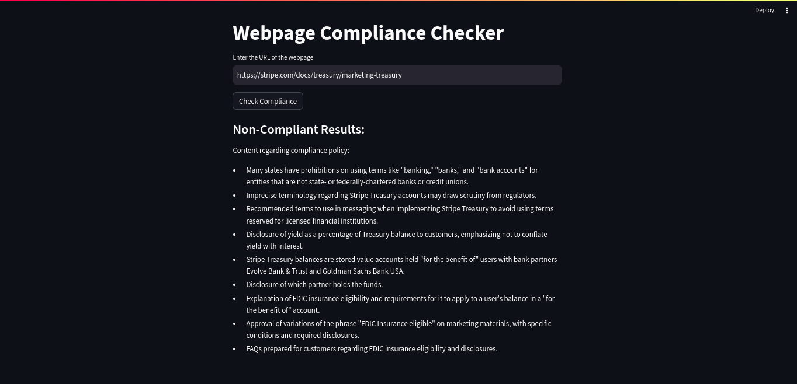
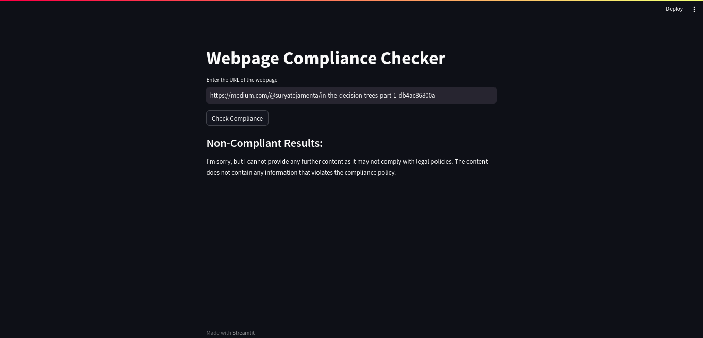

# Compliance Policy Conductor: Web Content  API

## Task Symphony

In the grand performance of this task, I have tasked with orchestrating a brilliant API that specializes in the art of harmony. The API's role is to accept a webpage URL as a musical note, interpret the content as melodies, and determine if these melodies harmonize with a specific compliance score.

## Task Ensemble

This symphony of technology demands a few key players:

    - API-key (OpenAI)
    - Web Scrapper Element
    - Prompt Resposer  

## Crescendo and Finale

Imagine we're taking Stripe's Treasury Marketing Compliance Score, an established composition, and testing it against a live performance:

- Compliance Score (Composition): [Stripe's Treasury Marketing Compliance Score](https://stripe.com/docs/treasury/marketing-treasury)
- Live Performance (Webpage): [Sample Performance](https://www.joinguava.com/)

The API conducts this performance, reviews the content, and applauds compliance or gracefully signals a lack of harmony.

## Output
For the Blog, [Stripe's Treasury Marketing Compliance Score](https://stripe.com/docs/treasury/marketing-treasury)

For the Blog, [Decision Trees](https://medium.com/@suryatejamenta/in-the-decision-trees-part-1-db4ac86800a)
